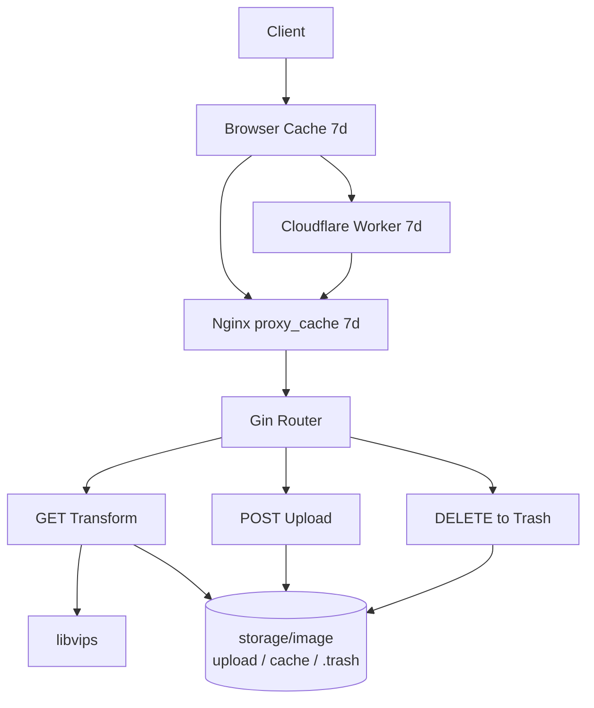

> [!NOTE]
> This README was generated by [SKILL](https://github.com/agenvoy/skill-readme-generate), get the ZH version from [here](./doc/README.zh.md).

***

<strong>RESIZE ONCE, CACHE EVERYWHERE!</strong>

***

> A self-hosted Go image caching server with on-the-fly libvips resizing, WebP/AVIF conversion, and four-layer CDN caching

## Table of Contents

- [Features](#features)
- [Architecture](#architecture)
- [License](#license)
- [Author](#author)

## Features

> `docker compose up -d` · [Documentation](./doc/doc.md)

- **Four-Layer Cache Chain** — Browser, Cloudflare Worker, Nginx `proxy_cache`, and parameterized local cache files intercept requests layer by layer, so libvips processes each variant only once.
- **URL-Driven Transforms** — Query parameters control size, quality, Gaussian blur, brightness, and output format (AVIF / WebP / JPG / PNG) with no pre-generated thumbnails.
- **WebP by Default** — Requests without parameters return WebP, and originals whose short edge exceeds 1024 px have their long edge scaled down to 1024 px to cut bandwidth.
- **Date-Bucketed Trash** — DELETE never removes files; it moves them into `.trash/YYYY-MM-DD/` and returns the trash location for later restore.
- **Adaptive Streaming** — Responses use chunked transfer with a 2–16 KiB buffer chosen by file size, balancing small-image latency and large-file throughput.

## Architecture

> [Full Architecture](./doc/architecture.md)

## License

This project is licensed under the [MIT LICENSE](LICENSE).

## Author

Just [open an issue](https://github.com/pardnchiu/go-image-server/issues/new) to share an idea.

***

©️ 2025 [邱敬幃 Pardn Chiu](https://www.linkedin.com/in/pardnchiu)
