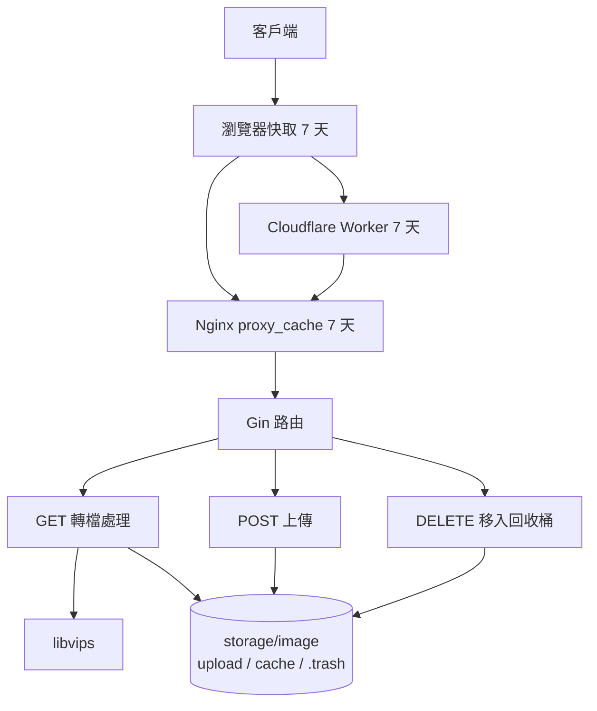

> [!NOTE]
> 此 README 由 [SKILL](https://github.com/agenvoy/skill-readme-generate) 生成，英文版請參閱 [這裡](../README.md)。

***

<strong>RESIZE ONCE, CACHE EVERYWHERE!</strong>

***

> Go 圖片快取伺服器，具備 libvips 即時轉檔、四層快取鏈與依日期分類的軟刪除回收桶

## 目錄

- [功能特點](#功能特點)
- [架構](#架構)
- [授權](#授權)
- [Author](#author)

## 功能特點

> `docker compose up -d` · [完整文件](./doc.zh.md)

- **四層快取鏈** — 瀏覽器、Cloudflare Worker、Nginx `proxy_cache` 與本地參數化快取檔逐層攔截，同一張圖只需由 libvips 處理一次。
- **URL 參數即時轉檔** — 以 query string 指定尺寸、品質、高斯模糊、亮度與輸出格式（AVIF／WebP／JPG／PNG），不需預先產生縮圖。
- **預設 WebP 瘦身** — 未指定參數時自動輸出 WebP，且短邊超過 1024 px 的原圖會將長邊縮至 1024 px，大幅降低傳輸量。
- **日期分類回收桶** — DELETE 不會真的刪檔，而是移入 `.trash/YYYY-MM-DD/`，並回傳回收位置供日後還原。
- **自適應串流輸出** — 依檔案大小動態選擇 2–16 KiB chunk buffer 以 chunked 傳輸回應，兼顧小圖延遲與大檔吞吐。

## 架構

> [完整架構](./architecture.zh.md)

## 授權

本專案採用 [MIT LICENSE](../LICENSE)。

## Author

Just [open an issue](https://github.com/pardnchiu/go-image-server/issues/new) to share an idea.

***

©️ 2025 [邱敬幃 Pardn Chiu](https://www.linkedin.com/in/pardnchiu)
