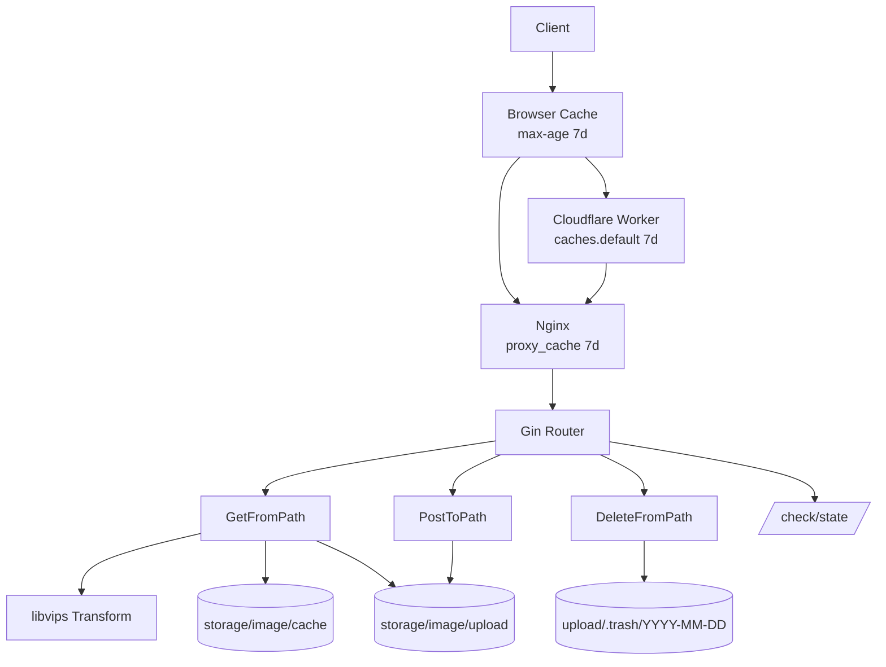
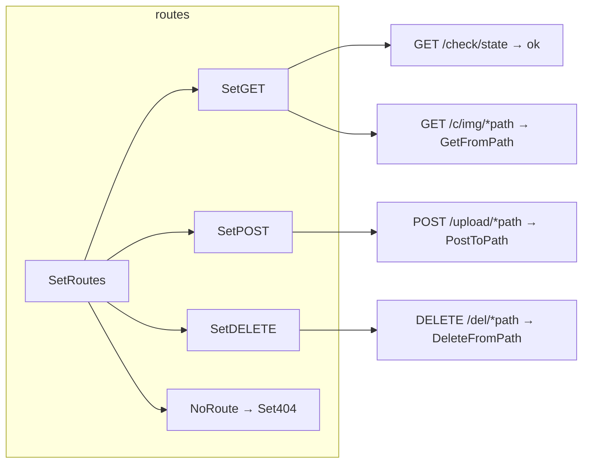
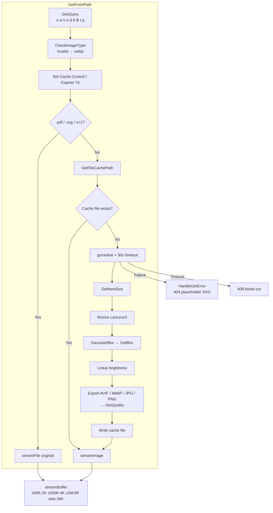
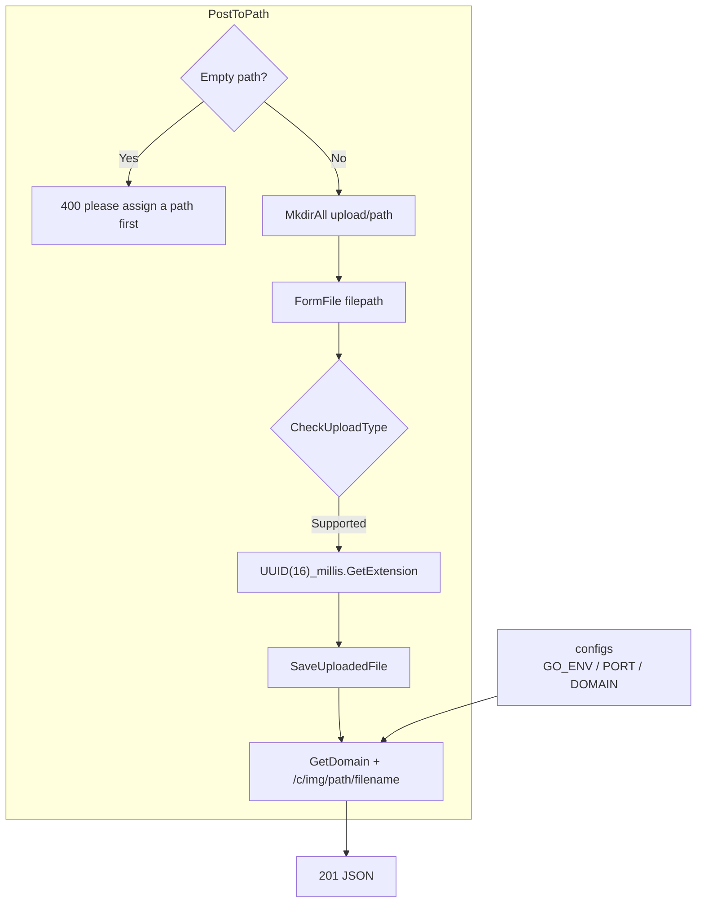
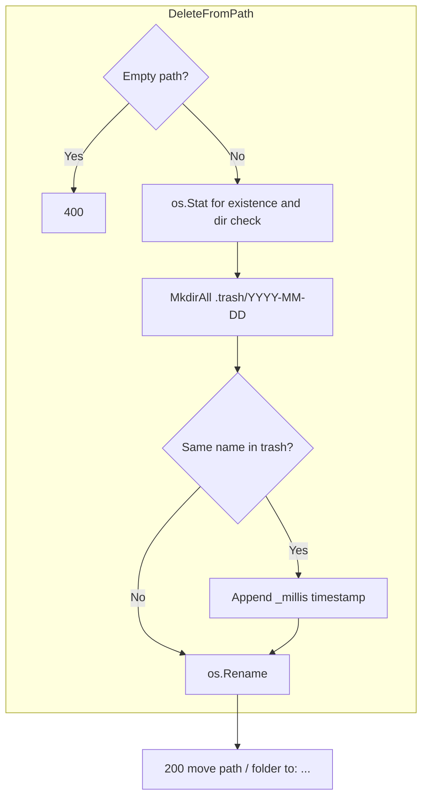
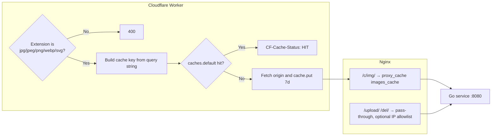
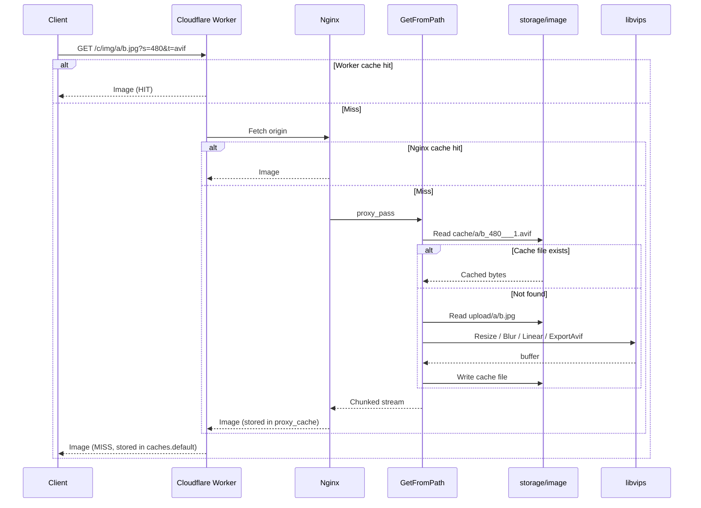

# go-image-server - Architecture

> Back to [README](../README.md)

## Overview

## Module: routes

Maps HTTP methods and paths to handlers; unknown paths return `404 Not Found`.

## Module: GetFromPath

Parses query parameters, serves a cache hit or transforms via libvips and writes back to the cache, then streams the response with an adaptive buffer.

## Module: PostToPath

Writes the multipart file into the target folder and returns a directly usable image URL.

## Module: DeleteFromPath

Replaces deletion with a move, bucketed by date with collision handling.

## Module: Edge Layer (Nginx + Cloudflare Worker)

Intercepts repeated requests in front of the Go service and only falls through to the origin on a miss.

## Data Flow

***

©️ 2025 [邱敬幃 Pardn Chiu](https://www.linkedin.com/in/pardnchiu)
