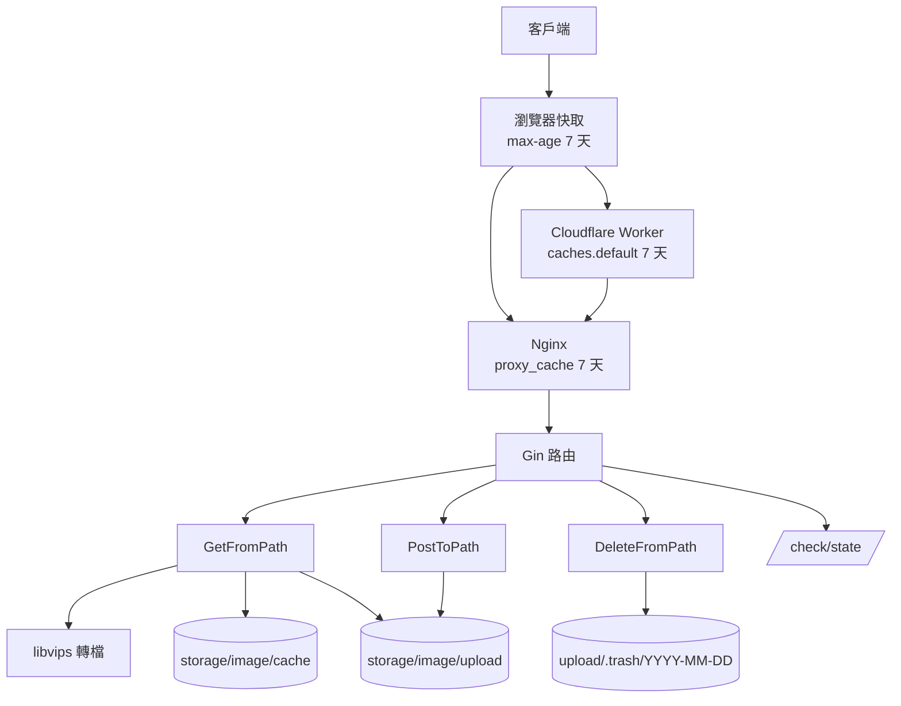
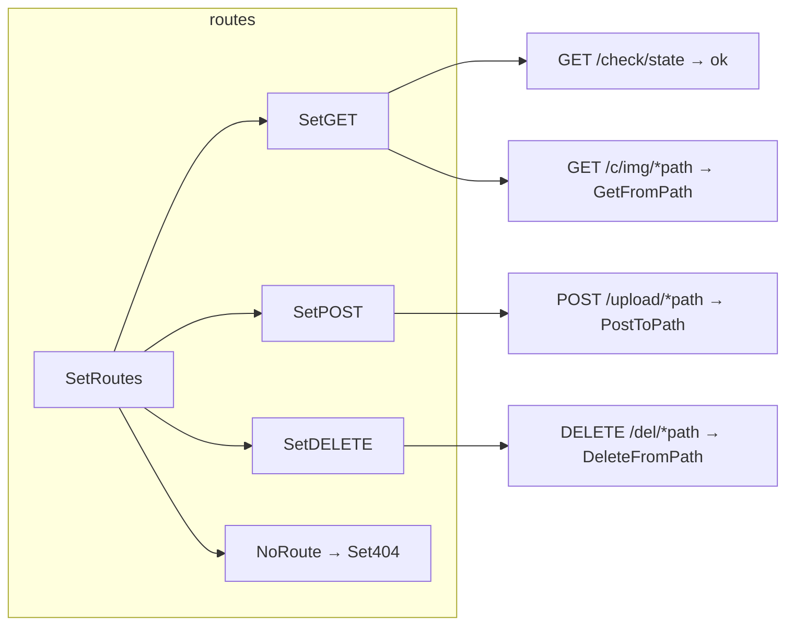
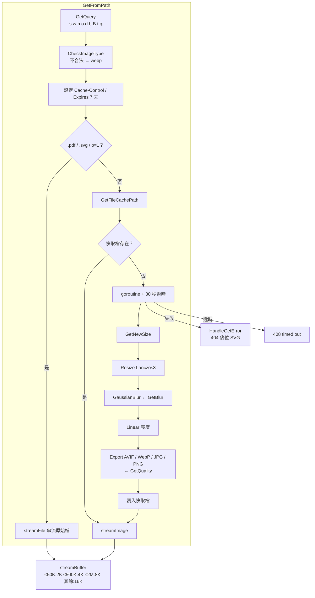
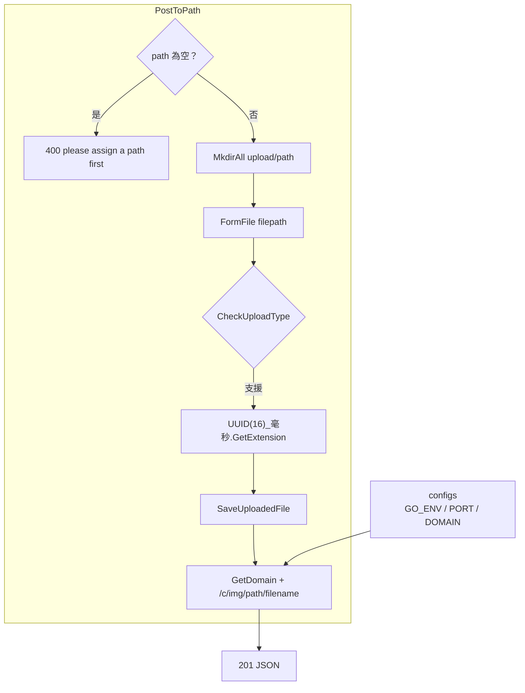
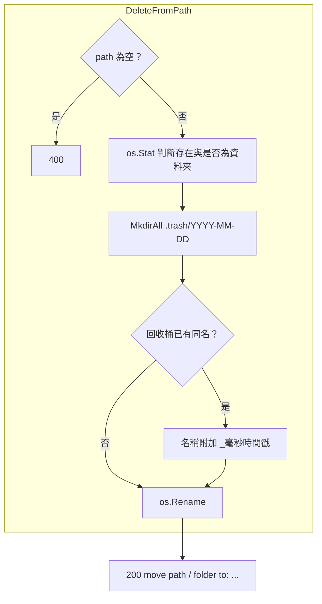
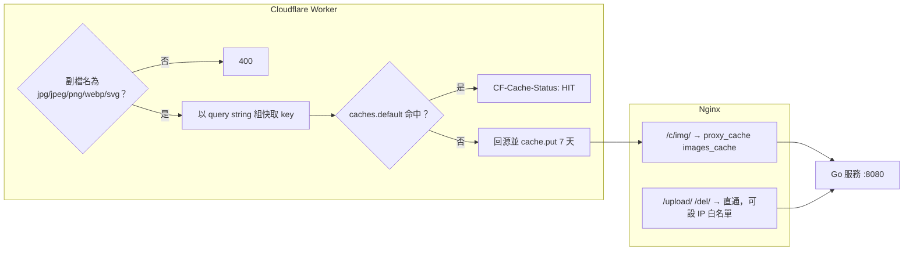
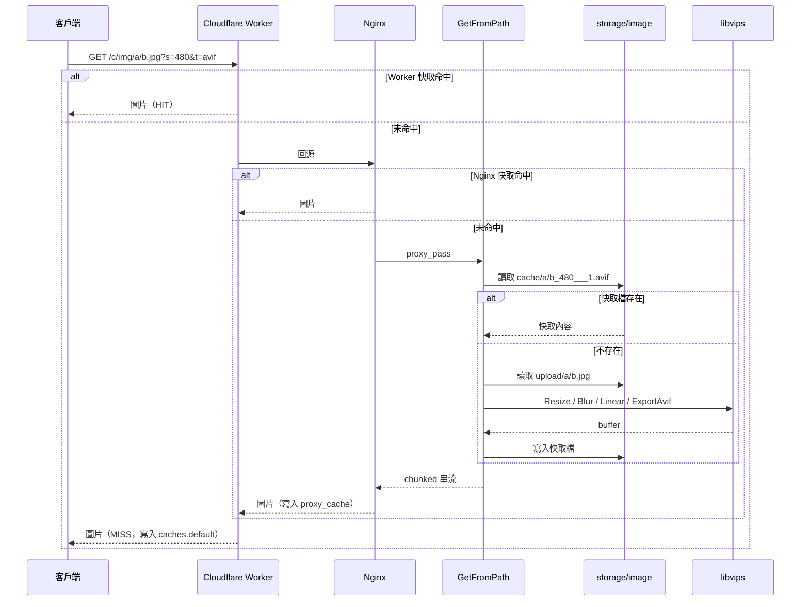

# go-image-server - 架構

> 返回 [README](./README.zh.md)

## 概覽

## Module: 路由（routes）

將 HTTP 方法與路徑對應到 handler，未知路徑回 `404 Not Found`。

## Module: 讀取與轉檔（GetFromPath）

解析 query 參數、命中快取檔或交由 libvips 轉檔並寫回快取，最後以自適應 buffer 串流回應。

## Module: 上傳（PostToPath）

將 multipart 檔案寫入指定資料夾並回傳可直接引用的圖片網址。

## Module: 刪除（DeleteFromPath）

以搬移取代刪除，依日期分桶並處理同名衝突。

## Module: 邊緣層（Nginx + Cloudflare Worker）

在 Go 服務前攔截重複請求，僅未命中時回源。

## 資料流

***

©️ 2025 [邱敬幃 Pardn Chiu](https://www.linkedin.com/in/pardnchiu)
